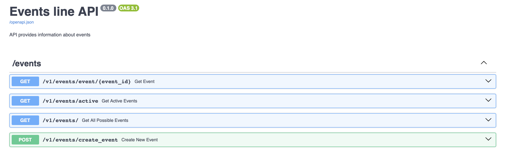
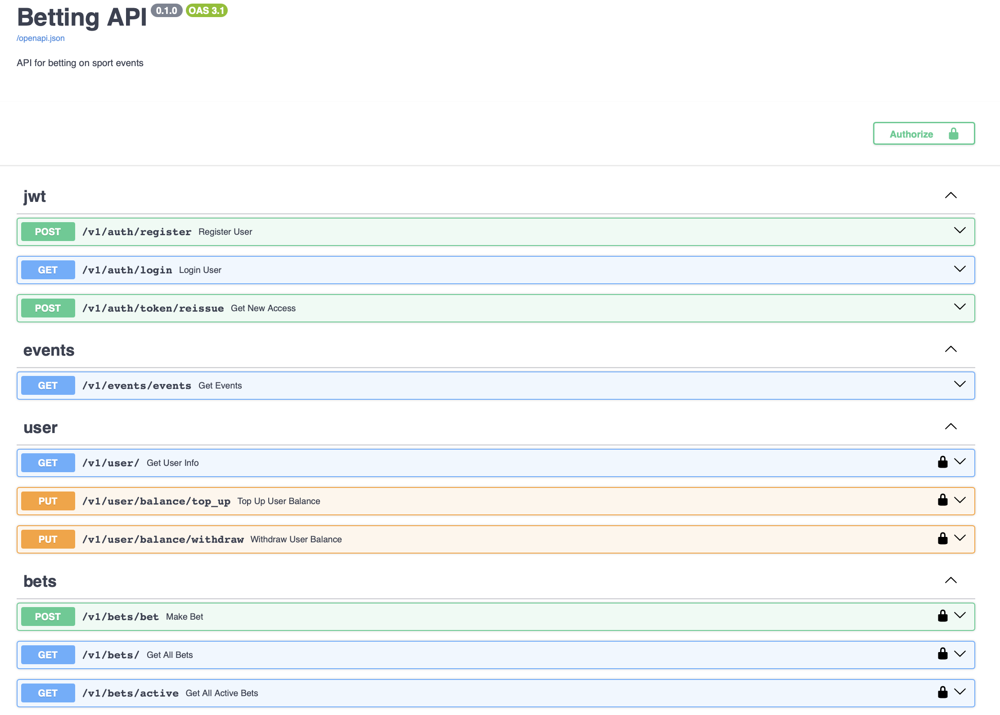
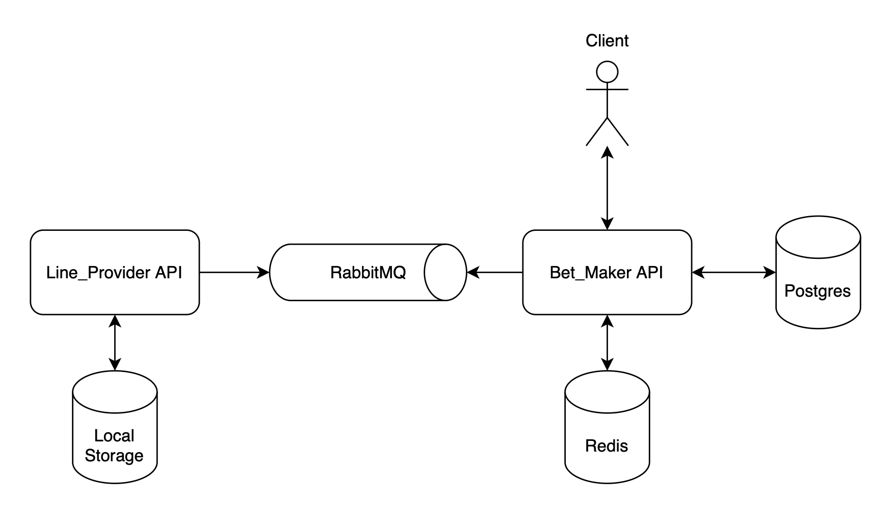

# test_betting-platform

## Описание проекта
Это тестовая платформа для управления ставками и событиями. Проект состоит из двух основных сервисов: `line_provider` для управления событиями и `bet_maker` для работы со ставками. Оба сервиса используют общие модули для конфигурации и утилит.

## Оглавление
- [Основные компоненты](#основные-компоненты)
- [Технологии](#технологии)
- [Структура проекта](#структура-проекта)
- [Line_Provider](#line_provider)
  - [Описание](#описание)
  - [API ручки](#api-ручки)
  - [Схема API](#схема-api)
- [Bet_Maker](#bet_maker)
  - [Описание](#описание-1)
  - [API ручки](#api-ручки-1)
  - [Схема API](#схема-api-1)
- [Логика общения](#логика-общения)
- [Запуск проекта](#запуск-проекта)
- [Тестирование](#тестирование)
- [Документация](#документация)

## Основные компоненты
Проект состоит из двух сервисов и общих модулей, которые работают вместе для выполнения задач. 

- **line_provider**: Отвечает за управление событиями.
- **bet_maker**: Работает с процессом создания и обработки ставок.
- **shared**: Содержит общие ресурсы и конфигурации, используемые обоими сервисами.

### Технологии
- **Python 3.10** — Язык программирования для разработки.
- **FastAPI** — Фреймворк для создания высокопроизводительных API.
- **Postgres** — СУБД для хранения данных.
- **Redis** — Система кеширования и обмена сообщениями.
- **RabbitMQ** — Система очередей для асинхронной обработки задач.
- **Docker** — Контейнеризация для упрощения развертывания и изоляции сервисов.
- **SQLAlchemy** — ORM для работы с базой данных.
- **Alembic** — Инструмент для управления миграциями базы данных.
- **Uvicorn** — ASGI сервер для запуска приложения.
- **Asyncio** — Модуль для асинхронного программирования.

## Структура проекта
```
test_betting-platform/
├── docker-compose.yml     # Управление сервисами (RabbitMQ, Redis, FastAPI, PostgreSQL)
├── .env.example           # Шаблон файла переменных окружения
├── pyproject.toml         # Конфигурация Poetry
├── poetry.lock            # Зафиксированные зависимости
├── line_provider/         # Сервис управления событиями
│   ├── app/               # Основная логика сервиса
│   │   ├── api/           # Маршруты API
│   │   │   └── v1/        # Версия 1 API
│   │   ├── core/          # Основные модули
│   │   │   ├── models/    # Pydantic модели
│   │   │   ├── schemas/   # Схемы (протоколы)
│   │   ├── repositories/  # Логика работы с базой данных
│   │   ├── services/      # Логика сервисов
│   │   ├── main.py        # Точка входа для приложения
│   ├── migrations/        # Миграции базы данных
│   ├── Dockerfile         # Docker-образ для сервиса
├── bet_maker/             # Сервис работы со ставками
│   ├── app/               # Основная логика сервиса
│   ├── migrations/        # Миграции базы данных
│   ├── Dockerfile         # Docker-образ для сервиса
├── shared/                # Общие ресурсы и конфигурации
│   ├── common_models/     # Общие Pydantic модели
│   ├── configs/           # Конфигурации для сервисов и базы данных
│   │   └── middleware/    # Общие middleware
│   ├── utils/             # Утилиты и логирование
├── tests/                 # Тесты для сервисов
├── README.md              # Описание проекта
```

## Line_Provider

### Описание
Сервис управления событиями. Предназначен для создания, получения и управления событиями.  

### API ручки
- **GET `/event/{event_id}`** — Получить подробную информацию о событии по его уникальному идентификатору.  
- **GET `/active`** — Получить список всех активных событий.  
- **GET `/`** — Получить список всех событий (активных и неактивных).  
- **POST `/create_event`** — Создать новое событие и вернуть его уникальный идентификатор.  

### Схема API



## Bet_Maker

### Описание
Сервис для работы со ставками, пользователями и событиями. Обеспечивает регистрацию и аутентификацию пользователей, создание ставок, управление балансом и доступ к событиям для ставок.  

### API ручки

#### **Auth**  
- **POST `/auth/register`** — Регистрация нового пользователя.  
- **GET `/auth/login`** — Авторизация пользователя.  
- **POST `/auth/token/reissue`** — Генерация нового JWT access токена по refresh токену.  

#### **Bets**  
- **POST `/bets/bet`** — Создать новую ставку.  
- **GET `/bets/`** — Получить историю ставок пользователя.  
- **GET `/bets/active`** — Получить список активных ставок пользователя.  

#### **Events**  
- **GET `/events/events`** — Получить список всех доступных событий для ставок.  

#### **User**  
- **GET `/user/`** — Получить информацию о пользователе.  
- **PUT `/user/balance/top_up`** — Пополнить баланс пользователя.  
- **PUT `/user/balance/withdraw`** — Вывести средства с баланса пользователя.  

### Схема API  



# Логика общения


## Запуск проекта

1. **Клонируйте репозиторий:**
   ```bash
   git clone https://github.com/CostGamer/test_betting-platform.git
   cd test_betting-platform
   ```

2. **Создайте и настройте `.env` файл:**
   Скопируйте `.env.example` в `.env` и заполните необходимые переменные окружения.

3. **Запустите сервисы с помощью Docker:**
   ```bash
   docker-compose up -d
   ```

4. **Примените миграции базы данных:**
   ```bash
   docker-compose exec line_provider alembic upgrade head
   docker-compose exec bet_maker alembic upgrade head
   ```

5. **Сервисы будут доступны по следующим адресам:**
   - `line_provider`: http://localhost:8000
   - `bet_maker`: http://localhost:8001

## Тестирование

Для запуска тестов выполните следующую команду:

```bash
docker-compose exec line_provider pytest
docker-compose exec bet_maker pytest
```

## Документация

- [Swagger Line_Provider](http://localhost:8000/docs)
- [Swagger Bet_Maker](http://localhost:8000/docs)
